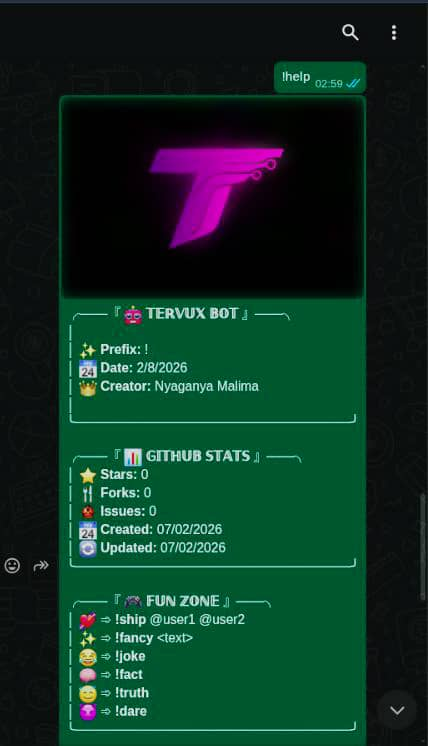
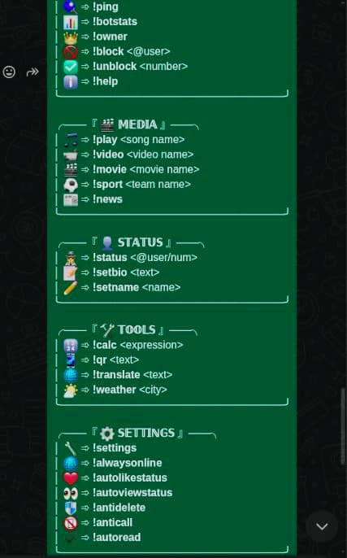

<div align="center">

  

  # 🤖 Tervux WhatsApp Bot

  <!-- Typing SVG Animation -->
  <a href="https://git.io/typing-svg">
    
  </a>

  <p align="center">
    <a href="https://github.com/JonniTech/Tervux-WhatsApp-Bot/stargazers"></a>
    <a href="https://github.com/JonniTech/Tervux-WhatsApp-Bot/forks"></a>
    <a href="https://github.com/JonniTech/Tervux-WhatsApp-Bot/issues"></a>
    <br>
    
    
    
  </p>

  <hr>

  <h2>🌍 Select Language / Chagua Lugha 🌍</h2>

  <a href="#-english-instructions-">
    
  </a>
  &nbsp;&nbsp;&nbsp;&nbsp;
  <a href="#-maelekezo-ya-kiswahili-">
    
  </a>

</div>

<br><br>

<!-- ENGLISH SECTION -->
<h1 id="-english-instructions-">🇺🇸 English Instructions 🇺🇸</h1>

## ✨ Introduction

**Tervux WhatsApp Bot** is a feature-rich, easy-to-deploy WhatsApp bot designed for everyone. Whether you want to manage groups, play games, download media, or use utility tools, Tervux Bot handles it all with style!

It is built on **Node.js** using the powerful **Baileys** library, ensuring stability and speed. Best of all, it's completely free to self-host!

<br>
<div align="center">
  
  <p><i>The bot's friendly welcome message!</i></p>
</div>
<br>

## 🚀 Features

| Feature | Description | Icon |
| :--- | :--- | :---: |
| **Media Downloader** | Download YouTube Music & Videos, Instagram, TikTok without watermark. | 🎬 |
| **Fun Games** | Truth or Dare, Ship, Fancy Text generator, Jokes, Facts. | 🎮 |
| **Group Management** | Admin tools like Anti-Delete, Anti-Call, Auto-Read. | 🛡️ |
| **Utility Tools** | Calculator, QR Code Generator, Translator, Weather. | 🛠️ |
| **Always Online** | Keeps your presence online 24/7 (configurable). | 🟢 |
| **Fancy Fonts** | All responses use premium Unicode fonts for a unique look. | 🎨 |

<br>
<div align="center">
  <h3>📸 Screenshots</h3>
  <table>
    <tr>
      <td align="center">
        
        <br><b>Help Menu Header</b>
      </td>
      <td align="center">
        
        <br><b>Help Menu Footer</b>
      </td>
    </tr>
  </table>
</div>
<br>

---

## 🛠️ Requirements

Before you start, make sure you have:
1.  **A GitHub Account** (to fork the repo).
2.  **WhatsApp App** on your phone (linked to the number you want to use as a bot).
3.  **Accounts** on Render or Railway (if deploying to cloud).

---

## 📲 Deployment Guide

Follow these simple steps to get your bot running in minutes!

### Step 1: Fork the Repository 🍴
Click the **Fork** button at the top right of this page to create your own copy of the code.

<br>

### Step 2: Choose Your Platform ☁️

#### Option A: Deploy on Railway 🚂
Railway offers great uptime and speed.

<a href="https://railway.app/new">

</a>

1.  Create an account on [Railway.app](https://railway.app/).
2.  Click **New Project** > **Deploy from GitHub repo**.
3.  Select your forked repo `Tervux-WhatsApp-Bot`.
4.  Go to **Settings** > **Variables** and add `PHONE` (optional).
5.  Wait for deployment. Go to the **Deployments** tab and view logs to scan the QR code.

#### Option B: Deploy on Render ☁️
Render is a solid alternative for hosting.

<a href="https://render.com/deploy">

</a>

1.  Create an account on [Render.com](https://render.com/).
2.  Click **New +** > **Web Service**.
3.  Connect your GitHub and select the repo.
4.  **Important:**
    *   **Build Command:** `npm install`
    *   **Start Command:** `npm start`
5.  Click **Create Web Service**.
6.  Once live, check the **Logs** tab to scan the QR code.

#### Option C: Local Installation 💻
Run the bot on your own computer (PC/Termux).

```bash
# 1. Clone the repository
git clone https://github.com/JonniTech/Tervux-WhatsApp-Bot.git

# 2. Enter the directory
cd Tervux-WhatsApp-Bot

# 3. Install dependencies
npm install

# 4. Start the bot
npm start
```

---

## ❓ FAQ

**Q: Where do I find the QR Code?**
A: Check the **Logs** (or Terminal) of your deployment platform immediately after starting the bot.

**Q: The session file expired?**
A: If the `auth_info` folder is deleted or corrupted, restart the bot to generate a new QR code.

**Q: How do I become the owner?**
A: The bot automatically recognizes the number that scans the QR code as the owner. Additional owners can be configured in `config.json`.

---

<br><br><br>

<!-- SWAHILI SECTION -->
<h1 id="-maelekezo-ya-kiswahili-">🇹🇿 Maelekezo ya Kiswahili 🇹🇿</h1>

## ✨ Utangulizi

**Tervux WhatsApp Bot** ni bot ya WhatsApp yenye nguvu na rahisi kutumia, iliyotengenezwa kwa ajili ya kila mtu. Iwe unataka kusimamia magroup, kucheza games, kupakua nyimbo na video, au kutumia zana mbalimbali, Tervux Bot inafanya yote haya kwa urahisi na mvuto!

Imetengenezwa kwa kutumia **Node.js** na library ya **Baileys**, ikihakikisha ufanisi na kasi. Na kizuri zaidi, ni **bure kabisa** kutumia!

<br>
<div align="center">
  
  <p><i>Ujumbe wa kukaribisha wa bot!</i></p>
</div>
<br>

## 🚀 Vipengele

| Kipengele | Maelezo | Ikoni |
| :--- | :--- | :---: |
| **Media Downloader** | Pakua miziki na video kutoka YouTube, Instagram, TikTok bila watermark. | 🎬 |
| **Games za Kuburudisha** | Truth or Dare, Ship (Upendo), Fancy Text, Vichekesho, Ukweli. | 🎮 |
| **Usimamizi wa Group** | Zana za Admin kama Anti-Delete, Anti-Call, Auto-Read. | 🛡️ |
| **Zana Mbalimbali** | Calculator, Kutengeneza QR Code, Translator (Mkalimani), Hali ya Hewa. | 🛠️ |
| **Always Online** | Inaweka status yako kuwa 'Online' muda wote (inawezekana kuzima). | 🟢 |
| **Mwandiko wa Mapambo** | Majibu yote yanatumia fonti nzuri za Unicode kupendezesha chat. | 🎨 |

<br>
<div align="center">
  <h3>📸 Picha za Skrini</h3>
  <table>
    <tr>
      <td align="center">
        
        <br><b>Kichwa cha Menyu</b>
      </td>
      <td align="center">
        
        <br><b>Mwisho wa Menyu</b>
      </td>
    </tr>
  </table>
</div>
<br>

---

## 🛠️ Mahitaji

Kabla ya kuanza, hakikisha una vitu hivi:
1.  **Akaunti ya GitHub** (ili kufanya 'Fork' project hii).
2.  **WhatsApp** kwenye simu yako (namba ambayo unataka iwe bot).
3.  **Akaunti** kwenye Render au Railway (kama unataka kuweka mtandaoni).

---

## 📲 Jinsi ya Ku-Deploy (Kuweka Hewani)

Fuata hatua hizi rahisi ili kuwasha bot yako ndani ya dakika chache!

### Hatua ya 1: Fork Repository 🍴
Bonyeza kitufe cha **Fork** juu kulia mwa ukurasa huu ili kutengeneza nakala yako ya code hizi.

<br>

### Hatua ya 2: Chagua Platform Yako ☁️

#### Chaguo A: Deploy kwenye Railway 🚂
Railway ni chaguo zuri kwa sababu inakaa hewani muda mrefu bila kuzima.

<a href="https://railway.app/new">

</a>

1.  Tengeneza akaunti [Railway.app](https://railway.app/).
2.  Bonyeza **New Project** > **Deploy from GitHub repo**.
3.  Chagua repo uliyofanya fork `Tervux-WhatsApp-Bot`.
4.  Nenda kwenye **Settings** > **Variables** na ongeza `PHONE` (kama unataka).
5.  Subiri imalize. Nenda kwenye tab ya **Deployments** na angalia logs ili ku-scan QR.

#### Chaguo B: Deploy kwenye Render ☁️
Render ni mbadala mzuri wa Heroku.

<a href="https://render.com/deploy">

</a>

1.  Tengeneza akaunti [Render.com](https://render.com/).
2.  Bonyeza **New +** > **Web Service**.
3.  Unganisha GitHub yako na chagua repo hii.
4.  **Muhimu:**
    *   **Build Command:** `npm install`
    *   **Start Command:** `npm start`
5.  Bonyeza **Create Web Service**.
6.  Ikikamilika, angalia tab ya **Logs** ili kuona QR code na ku-scan.

#### Chaguo C: Kuweka kwenye PC/Termux 💻
Unaweza kuwasha bot kwenye kompyuta yako au kutumia Termux.

```bash
# 1. Clone repository hii
git clone https://github.com/JonniTech/Tervux-WhatsApp-Bot.git

# 2. Ingia ndani ya folda
cd Tervux-WhatsApp-Bot

# 3. Install dependencies (mahitaji)
npm install

# 4. Washa bot
npm start
```

---

## ❓ Maswali Yanayoulizwa Sana (FAQ)

**Swali: QR Code nitaipata wapi?**
Jibu: Angalia sehemu ya **Logs** (au Terminal) kwenye platform uliyotumia mara tu baada ya kuwasha bot.

**Swali: Session ime-expire?**
Jibu: Futa folda ya `auth_info` kama ipo, kisha washa bot upya (Restart) ili kupata QR code mpya.

**Swali: Je, nani anakuwa mmiliki (Owner)?**
Jibu: Namba inayotumika ku-scan QR code inatambulika kiotomatiki kama Owner. Unaweza kuongeza namba zingine kwenye `config.json`.

---

<div align="center">
  <p>Made with ❤️ by <b>Tervux Team</b></p>
  
</div>
