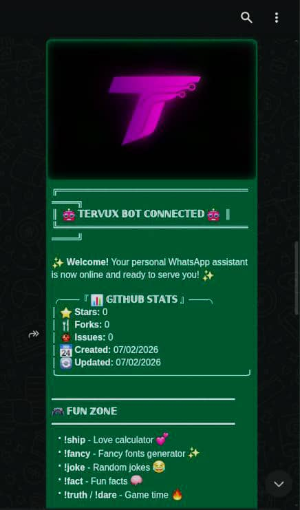

<!-- CIRCULAR LOGO WITH GLOW HACK -->
<svg width="250" height="250" viewBox="0 0 250 250">
  <defs>
    <filter id="glow">
      <feGaussianBlur stdDeviation="6" result="coloredBlur"/>
      <feMerge>
        <feMergeNode in="coloredBlur"/>
        <feMergeNode in="SourceGraphic"/>
      </feMerge>
    </filter>
    <pattern id="logoPattern" x="15" y="15" width="220" height="220" patternUnits="userSpaceOnUse">
      <image x="0" y="0" width="220" height="220" href="https://raw.githubusercontent.com/JonniTech/Tervux-WhatsApp-Bot/main/public/tervus-logo.png" />
    </pattern>
  </defs>
  <!-- Animated Pulse Outer Circle -->
  <circle cx="125" cy="125" r="115" fill="none" stroke="#25D366" stroke-width="2" opacity="0.6">
     <animate attributeName="r" values="115;120;115" dur="3s" repeatCount="indefinite" />
     <animate attributeName="opacity" values="0.6;0;0.6" dur="3s" repeatCount="indefinite" />
  </circle>
  
  <circle cx="125" cy="125" r="112" fill="none" stroke="#25D366" stroke-width="4" opacity="0.8" filter="url(#glow)" />
  <circle cx="125" cy="125" r="110" fill="url(#logoPattern)" stroke="#25D366" stroke-width="3" />
</svg>

 

<!-- PRIMARY ANIMATED HEADER -->

  
  
  

<!-- LANGUAGE SELECTOR -->
<table align="center" border="0" cellspacing="20">
  <tr>
    <td>
      
    </td>
    <td>
      
    </td>
  </tr>
</table>

  

---

  

 

<!-- WELCOME CARD -->

  
  
<i>Powering your WhatsApp experience with speed and style.</i>

  

<!-- DEPLOYMENT HEADER -->

  

 

<!-- PHASE 1: ENVIRONMENT SETUP -->

  <svg width="800" height="200" viewBox="0 0 800 200">
    <!-- Background & Border -->
    <rect x="5" y="5" width="790" height="190" rx="30" fill="#0d1117" stroke="#00BFFF" stroke-width="4" />
    
    <!-- Big Number Backdrop -->
    <text x="650" y="160" font-family="Arial Black" font-size="150" fill="#00BFFF" opacity="0.1">01</text>
    
    <!-- Content -->
    <text x="40" y="60" font-family="Verdana" font-size="32" font-weight="bold" fill="#00BFFF">ENVIRONMENT SETUP</text>
    
    <text x="40" y="110" font-family="Consolas" font-size="20" fill="#EEEEEE">1. FORK this repository to your GitHub.</text>
    <text x="40" y="145" font-family="Consolas" font-size="20" fill="#EEEEEE">2. Get a WhatsApp number ready.</text>

    <!-- Animated Border Line -->
    <rect x="5" y="5" width="790" height="190" rx="30" fill="none" stroke="#00BFFF" stroke-width="6" stroke-dasharray="40 20">
      <animate attributeName="stroke-dashoffset" from="0" to="200" dur="2s" repeatCount="indefinite" />
    </rect>
  </svg>

  

<!-- PHASE 2: CLOUD DEPLOYMENT -->

  

 

<!-- METHOD A: RAILWAY -->

  <svg width="800" height="220" viewBox="0 0 800 220">
    <rect x="5" y="5" width="790" height="210" rx="30" fill="#0d1117" stroke="#A020F0" stroke-width="4" />
    
    <text x="650" y="180" font-family="Arial Black" font-size="150" fill="#A020F0" opacity="0.1">02</text>
    
    <text x="40" y="60" font-family="Verdana" font-size="32" font-weight="bold" fill="#A020F0">METHOD A: RAILWAY</text>
    
    <text x="40" y="100" font-family="Consolas" font-size="18" fill="#DDD">1. Link GitHub to Railway.app</text>
    <text x="40" y="130" font-family="Consolas" font-size="18" fill="#DDD">2. Add 'PHONE' variable (Country Code included)</text>
    <text x="40" y="160" font-family="Consolas" font-size="18" fill="#DDD">3. Deploy & Scan Pairing Code from Logs</text>

    <rect x="5" y="5" width="790" height="210" rx="30" fill="none" stroke="#A020F0" stroke-width="6" stroke-dasharray="20 40">
      <animate attributeName="stroke-dashoffset" from="0" to="-200" dur="3s" repeatCount="indefinite" />
    </rect>
  </svg>

 

<!-- METHOD B: RENDER -->

  <svg width="800" height="220" viewBox="0 0 800 220">
    <rect x="5" y="5" width="790" height="210" rx="30" fill="#0d1117" stroke="#ffffff" stroke-width="4" />
    
    <text x="40" y="60" font-family="Verdana" font-size="32" font-weight="bold" fill="#ffffff">METHOD B: RENDER</text>
    
    <text x="40" y="100" font-family="Consolas" font-size="18" fill="#DDD">1. Create Web Service -> Connect GitHub</text>
    <text x="40" y="130" font-family="Consolas" font-size="18" fill="#DDD">2. Build: npm install | Start: npm start</text>
    <text x="40" y="160" font-family="Consolas" font-size="18" fill="#DDD">3. Wait for 'Live' status & Check Logs</text>

    <rect x="5" y="5" width="790" height="210" rx="30" fill="none" stroke="#ffffff" stroke-width="4">
      <animate attributeName="stroke-opacity" values="1;0.2;1" dur="2s" repeatCount="indefinite" />
    </rect>
  </svg>

  

<!-- PHASE 3: LOCAL -->

  <svg width="800" height="200" viewBox="0 0 800 200">
    <rect x="5" y="5" width="790" height="190" rx="30" fill="#0d1117" stroke="#FF4500" stroke-width="4" />
    
    <text x="650" y="160" font-family="Arial Black" font-size="150" fill="#FF4500" opacity="0.1">03</text>
    
    <text x="40" y="60" font-family="Verdana" font-size="32" font-weight="bold" fill="#FF4500">LOCAL / TERMUX</text>
    
    <text x="40" y="100" font-family="Consolas" font-size="18" fill="#00FF00">git clone https://github.com/JonniTech/Tervux-WhatsApp-Bot</text>
    <text x="40" y="130" font-family="Consolas" font-size="18" fill="#00FF00">cd Tervux-WhatsApp-Bot</text>
    <text x="40" y="160" font-family="Consolas" font-size="18" fill="#00FF00">npm install && npm start</text>

    <rect x="5" y="5" width="790" height="190" rx="30" fill="none" stroke="#FF4500" stroke-width="6" stroke-dasharray="10 10">
      <animate attributeName="stroke-dashoffset" from="100" to="0" dur="1s" repeatCount="indefinite" />
    </rect>
  </svg>

   

---

 

  

 

<!-- WELCOME CARD -->

  
  
<i>Karibu kwenye ulimwengu wa Tervux Bot.</i>

  

<!-- HATUA 1: MAANDALIZI -->

  <svg width="800" height="200" viewBox="0 0 800 200">
    <rect x="5" y="5" width="790" height="190" rx="30" fill="#0d1117" stroke="#00BFFF" stroke-width="4" />
    <text x="650" y="160" font-family="Arial Black" font-size="150" fill="#00BFFF" opacity="0.1">01</text>
    <text x="40" y="60" font-family="Verdana" font-size="32" font-weight="bold" fill="#00BFFF">MAANDALIZI (SETUP)</text>
    <text x="40" y="110" font-family="Consolas" font-size="20" fill="#EEEEEE">1. FORK hii repository kwenda kwako.</text>
    <text x="40" y="145" font-family="Consolas" font-size="20" fill="#EEEEEE">2. Andaa namba ya simu ya WhatsApp.</text>
    <rect x="5" y="5" width="790" height="190" rx="30" fill="none" stroke="#00BFFF" stroke-width="6" stroke-dasharray="40 20">
      <animate attributeName="stroke-dashoffset" from="0" to="200" dur="2s" repeatCount="indefinite" />
    </rect>
  </svg>

  

<!-- HATUA 2: MTANDAONI -->

  <svg width="800" height="220" viewBox="0 0 800 220">
    <rect x="5" y="5" width="790" height="210" rx="30" fill="#0d1117" stroke="#A020F0" stroke-width="4" />
    <text x="650" y="180" font-family="Arial Black" font-size="150" fill="#A020F0" opacity="0.1">02</text>
    <text x="40" y="60" font-family="Verdana" font-size="32" font-weight="bold" fill="#A020F0">RAILWAY (INASHAURIWA)</text>
    <text x="40" y="100" font-family="Consolas" font-size="18" fill="#DDD">1. Unganisha GitHub na Railway.app</text>
    <text x="40" y="130" font-family="Consolas" font-size="18" fill="#DDD">2. Weka 'PHONE' variable (Pamoja na kodi ya nchi)</text>
    <text x="40" y="160" font-family="Consolas" font-size="18" fill="#DDD">3. Deploy na angalia Logs ili kuunga.</text>
    <rect x="5" y="5" width="790" height="210" rx="30" fill="none" stroke="#A020F0" stroke-width="6" stroke-dasharray="20 40">
      <animate attributeName="stroke-dashoffset" from="0" to="-200" dur="3s" repeatCount="indefinite" />
    </rect>
  </svg>

 

  <svg width="800" height="220" viewBox="0 0 800 220">
    <rect x="5" y="5" width="790" height="210" rx="30" fill="#0d1117" stroke="#ffffff" stroke-width="4" />
    <text x="40" y="60" font-family="Verdana" font-size="32" font-weight="bold" fill="#ffffff">RENDER (MBADALA)</text>
    <text x="40" y="100" font-family="Consolas" font-size="18" fill="#DDD">1. Tengeneza Web Service -> Unga GitHub</text>
    <text x="40" y="130" font-family="Consolas" font-size="18" fill="#DDD">2. Build: npm install | Start: npm start</text>
    <text x="40" y="160" font-family="Consolas" font-size="18" fill="#DDD">3. Subiri 'Live' na angalia Logs.</text>
    <rect x="5" y="5" width="790" height="210" rx="30" fill="none" stroke="#ffffff" stroke-width="4">
      <animate attributeName="stroke-opacity" values="1;0.2;1" dur="2s" repeatCount="indefinite" />
    </rect>
  </svg>

  

<!-- HATUA 3: TERMUX -->

  <svg width="800" height="200" viewBox="0 0 800 200">
    <rect x="5" y="5" width="790" height="190" rx="30" fill="#0d1117" stroke="#FF4500" stroke-width="4" />
    <text x="650" y="160" font-family="Arial Black" font-size="150" fill="#FF4500" opacity="0.1">03</text>
    <text x="40" y="60" font-family="Verdana" font-size="32" font-weight="bold" fill="#FF4500">TERMUX / LOCALHOST</text>
    <text x="40" y="100" font-family="Consolas" font-size="18" fill="#00FF00">git clone https://github.com/JonniTech/Tervux-WhatsApp-Bot</text>
    <text x="40" y="130" font-family="Consolas" font-size="18" fill="#00FF00">cd Tervux-WhatsApp-Bot</text>
    <text x="40" y="160" font-family="Consolas" font-size="18" fill="#00FF00">npm install && npm start</text>
    <rect x="5" y="5" width="790" height="190" rx="30" fill="none" stroke="#FF4500" stroke-width="6" stroke-dasharray="10 10">
      <animate attributeName="stroke-dashoffset" from="100" to="0" dur="1s" repeatCount="indefinite" />
    </rect>
  </svg>

   

  
   
  
CREATED BY NYAGANYA MALIMA NYAGANYA

   
  

